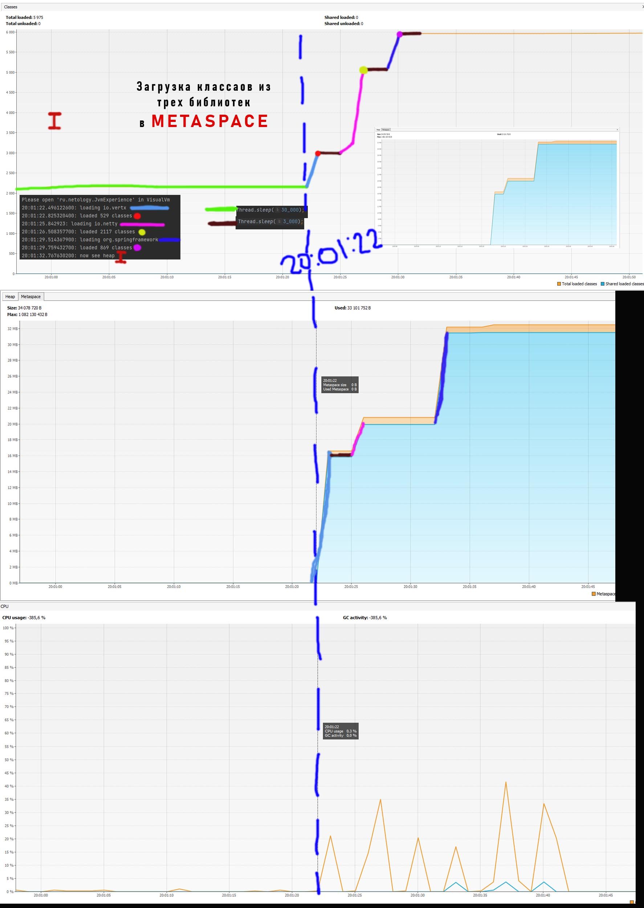

# HomeWork_JVM_Experience
## Использование Metaspace

1. К 20:00:58 в Мета были загружены необходимые JDK классы ,а также rg.reflections.Reflections; java.time.LocalTime;  java.util.ArrayList; java.util.List;
java.util.Set; и JvmExperience, с соответствующими static методами и полями.  Система находилась в состоянии ожидания. Об этом говорит график. И процессор и память и количество 
классов находятся в стабильном состоянии. 
2. Далее ожидание 30 сек.
3. В 20:01:22 ожидание заканчивается, запускается метод loadToMetaspaceAllFrom("io.vertx"); который грузит библиотеку io.vertx. Классы static методы, поля в MEtaspace. 
Это хорошо видно на графике. Старт загрузки первой библиотеки отмечен синим вертикальным пунктиром. Процесс загрузки Библиотеки io.vertx отмечен голубым цветом.
4. Далее красная точка на грвафике указывает момент времени, в котором все из библиотеки io.vertx загружено и система снова встает на ожидание на 3сек (Thread.sleep(3_000)). 
коричневая линия на графике.
5. Ожидание заканчивается, запускается метод loadToMetaspaceAllFrom("io.netty"); который грузит библиотеку io.netty. Классы static методы, поля в MEtaspace. 
Это хорошо видно на графике. Процесс загрузки Библиотеки io.netty отмечен розовым цветом .
6. Далее желтая точка на грвафике указывает момент времени, в котором все из библиотеки io.netty загружено и система снова встает на ожидание на 3сек (Thread.sleep(3_000)). 
коричневая линия на графике.
7. Ожидание заканчивается, запускается метод loadToMetaspaceAllFrom("org.springframework"); который грузит библиотеку org.springframework. Классы static методы, 
поля в MEtaspace. Это хорошо видно на графике. Процесс загрузки Библиотеки org.springframework отмечен синим цветом.
8. Далее розовая точка на грвафике указывает момент времени, в котором все из библиотеки org.springframework загружено и система снова встает на ожидание на 3сек (Thread.sleep(3_000)). 
коричневая линия на графике.
9. Ожидание заканчивается, переходим к рассмотрению графика heap.

### Вывод (не сильно вдаваясь в точные значения): 
1. Сравнивая по числу Классов, io.vertx и org.springframework приерно равны, а io.netty, более чем в 2 раза, больше каждого из них.
2. Сравнивая по объему памяти, io.vertx и org.springframework приерно равны, а io.netty, менее чем в 2 раза, меньше каждого из них.
3. Исходя из п.1. и п.2. Можно сказать, что при меньшем числе классов, библиотеки io.vertx и org.springframework более наполнены полями и методами, чем 
классы библиотеки io.netty
4. Также, рассмтривая работу CPU и GC на графике CPU (коричневая и голубая линии соответственно), можно сказать, что в процессе загрузки классов "сборщик" не подключался, 
а дальнейщаяя его работа никак не отразилась на размере Metaspace. Работу с heap рассмотрю ниже.
5. Также, рассмтривая работу CPU и GC на графике CPU (коричневая и голубая линии соответственно), можно сказать, что в процессе загрузки классов линейно росла нагрузка 
на процессор. (Первые три пика). 
6. После загрузки третьей библиотеки "org.springframework", Metaspace не увеличивалась в размерах. Это говорит о том, что в процессе дальнейшего выполнения программы, 
дополнительные библиотке не подгружались.

## Использование heap ( в дальнейшем по тексту "куча" )

